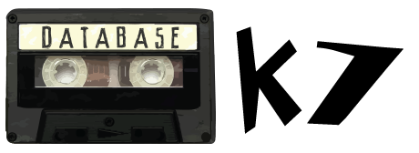

[**hapi**](https://github.com/hapijs/hapi) database connector

[](https://travis-ci.org/thebergamo/k7)
[](https://david-dm.org/thebergamo/k7)
[](https://david-dm.org/thebergamo/k7#info=devDependencies)
[](https://snyk.io/test/npm/k7)
[](https://github.com/Flet/semistandard)


K7 is the simplest way to connect Hapi.js with your favorite Database Mapper, you can use any of ours available connectors for the most populars Databases.

## Example Usage

For example: 

```javascript
const Hapi = require('hapi');
const Server = new Hapi.Server();

Server.connection({host: 'localhost'});

let options = {
    adapter: require('k7-mongoose'),
    connectionString: 'mongodb://localhost:27017/K7Mongoose'
};

Server.register({
    register: require('k7'),
    options: options
}, (err) => {
    if (err) {
        throw err;
    }
    
    Server.start((err) => {
        if (err) {
            throw err;
        }
        
        Server.log('info', 'Server running at: ' + Server.info.uri);
    });
});
```

This example does:  
1. Setting the k7-mongoose adapter  
2. Setting the connectionString for mongoose connect  
3. Register the k7 to Hapi.js  

## Options
k7 have minimal options, and the major options are specified in ours Adapters. 

* **connectionString**: Is a common option, specified a connectionString to connecto in your database.
* **connectionOptions**: Is a common option, where you will specify the options passed for the connector. 
* **models**: Is a common option, where you will specify how we can find your models. **Default**: `models/*.js` In this option you can pass a String or an Array of files or glob patterns like: `**/model.js`

## Where my Models?
Your models will be available in `server.database` all of your databases will be there. In `server.database` have the instance of the Database Mapper used too.

If your model are in a file called `models/user.js`, the model will be avaiblable as `server.database.User`.

## Adapters
* [k7-bookshelf][k7-bookshelf] (WIP)
* [k7-mongoose][k7-mongoose]
* [k7-sequelize][k7-sequelize]

## Write your own adapter
The K7 API is very simple, your adapter just need be a Class and export a function `load` and return an Object with all models and the Database Mapper instance for k7 decorate the database in Hapi.js.
For more examples, please see the source code in the [k7-sequelize][k7-sequelize] plugin.

## Testing
For testing you just need clone this repo and run `npm install && npm test` inside root folder of this project.; 


[k7-mongoose]: https://github.com/thebergamo/k7-mongoose
[k7-sequelize]: https://github.com/thebergamo/k7-sequelize
[k7-bookshelf]: https://github.com/thebergamo/k7-bookshelf
